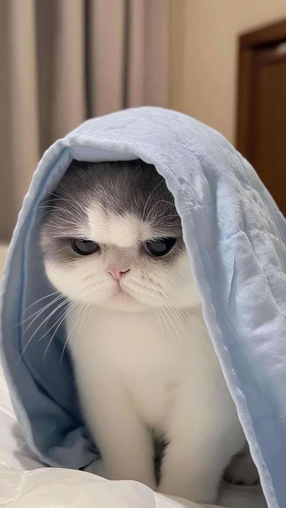

## Hi there 👋

**rpaniagua8/rpaniagua8** is a ✨ _special_ ✨ repository because its `README.md` (this file) appears on your GitHub profile.

About me:

- Current student at Harold Washington College
- First piece of technology owned Gameboy Advance SP
- Hometown is Chicago,IL
- Studying Mathematics and Computer Science
- I enjoy studying Math and Computer Science , playing chess, and video games on my free time. I have also recently picked up going to the gym, which i currently am enjoying. I am planning to transfer to UIC in the fall, I am excited for that. Currently have experience with Python and C++. Additionally I want to add to improve my chess elo, I'm currently rated 1200.

  

